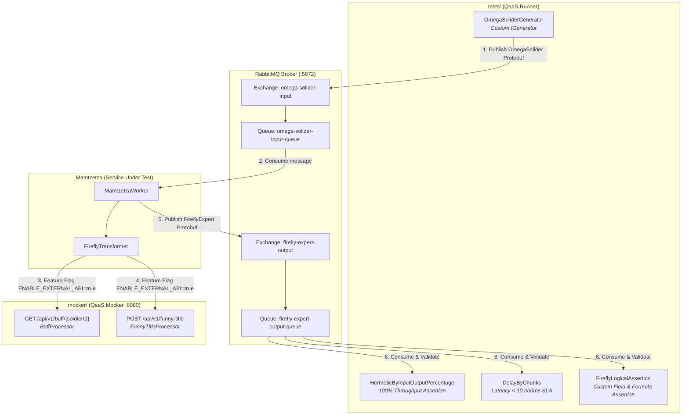

# Mamtzetza Reference QaaS Test Suite & Mocker

> **Working Tests Example & Teacher's Solution Key**  
> This repository is the official reference implementation for testing the [Mamtzetza](https://github.com/eldarush/Mamtzetza) microservice using the **QaaS (Quality as a Service)** ecosystem (`QaaS.Runner 4.8.2`, `QaaS.Mocker 2.4.7`, `QaaS.Common.Assertions 3.5.6`, `QaaS.Common.Generators 3.5.6`).

---

## 🎯 Purpose of this Repository

This is **not** a set of trivia or quiz questions about QaaS. This is an **executable, production-ready reference test suite** that actively tests and validates that the `Mamtzetza` microservice works correctly in a realistic, containerized environment.

As an instructor, you can use this repository as a **golden reference / answer key** to compare student submissions and suggestions against, verifying that their generators, mockers, session configurations, and assertions adhere to best practices.

---

## 🏗 Repository Structure

The repository is cleanly split into two distinct components:

```
mamtzetza-qaas-tests/
├── mocker/                          # 🎭 QaaS.Mocker HTTP Server
│   ├── Processors/
│   │   ├── BuffProcessor.cs         # GET /api/v1/buff/{soldierId}
│   │   └── FunnyTitleProcessor.cs   # POST /api/v1/funny-title
│   ├── Dockerfile                   # Builds mamtzetza-mocker container
│   ├── MamtzetzaMocker.csproj       # .NET 10 project using QaaS.Mocker 2.4.7
│   ├── Program.cs                   # Mocker host startup
│   └── mocker.qaas.yaml             # Declarative routes & stubs configuration
│
├── tests/                           # 🧪 QaaS.Runner Test Suite
│   ├── Assertions/
│   │   └── FireflyLogicalAssertion.cs # Custom IAssertion verifying business logic & fields
│   ├── Generators/
│   │   └── OmegaSoliderGenerator.cs   # Custom IGenerator generating Protobuf samples
│   ├── Dockerfile                   # Builds mamtzetza-runner-tests container
│   ├── MamtzetzaTests.csproj        # .NET 10 project using QaaS.Runner 4.8.2
│   ├── Program.cs                   # Runner CLI entrypoint
│   ├── test.qaas.yaml               # Test session for local host execution
│   └── test-docker.qaas.yaml        # Test session for Docker Compose network execution
│
├── packages/                        # 📦 Local Protobuf NuGet package
│   └── OmegaSolider.1.0.0.nupkg     # Hermetic dependency for offline Docker builds
│
├── docker-compose.yml               # 🐳 Full orchestration: RabbitMQ + Mocker + Mamtzetza + Tests
├── MamtzetzaTests.slnx              # Root solution file referencing mocker & tests
├── NuGet.config                     # Configured for local packages + nuget.org
└── README.md                        # This documentation & evaluation guide
```

---

## 🔄 End-to-End Test Architecture



---

## 🔍 Detailed Component Implementations

### 1. Custom Generator (`tests/Generators/OmegaSoliderGenerator.cs`)
Generates structured `OmegaSolider` Protobuf messages and serializes them to raw bytes for RabbitMQ direct publishing:
```csharp
[Type("OmegaSoliderGenerator")]
public class OmegaSoliderGenerator : BaseGenerator<OmegaSoliderGeneratorConfig>
{
    public override IEnumerable<Data<object>> Generate(...)
    {
        for (int i = 1; i <= Configuration.Count; i++)
        {
            var soldier = new OmegaSolider.Messages.OmegaSolider
            {
                SoldierId = $"{Configuration.IdPrefix}{i:D3}",
                Codename = $"Bravo-{i}",
                RankLevel = (i % 5) + 1,
                BraveryPoints = i * 15,
                FavoriteSnack = Configuration.FavoriteSnack
            };
            yield return new Data<object> { Body = soldier.ToByteArray() };
        }
    }
}
```

### 2. Custom HTTP Mocker (`mocker/Processors/`)
Implements two distinct HTTP methods to simulate a third-party character enrichment service:
- **GET `/api/v1/buff/{soldierId}`**: Handled by `BuffProcessor`, returns:
  ```json
  { "soldierId": "SOL-001", "buffName": "Quantum Disco Sparkles", "bonusGlow": 50 }
  ```
- **POST `/api/v1/funny-title`**: Handled by `FunnyTitleProcessor`, accepts soldier data and returns:
  ```json
  { "title": "Supreme Commander of Quantum Doritos", "funnyLore": "Fights crime with crunch." }
  ```

### 3. Custom Field & Business Logic Assertion (`tests/Assertions/FireflyLogicalAssertion.cs`)
Validates that `Mamtzetza` executed the transformation faithfully:
1. **Identity Preservation**: `SoldierId`, `Codename`, and `RankLevel` match the input exactly.
2. **Formula Correctness**:
   $$\text{GlowIntensity} = (\text{RankLevel} \times 10) + (\text{BraveryPoints} \times 2) + \text{BonusGlow}$$
3. **Comedic Buff**: Verifies that `ComedicBuff` contains the mock's buff name (`"Quantum Disco Sparkles"`) and humorous title (`"Supreme Commander of Quantum Doritos"`).
4. **Snack Logistics**: Verifies `Expertise` equals `"Expert in {FavoriteSnack} Logistics"`.

### 4. Built-in Assertions
- `HermeticByInputOutputPercentage`: Ensures 100% throughput (all inputs match outputs without message loss).
- `DelayByChunks`: Ensures the round-trip latency stays within the 10-second SLA.

---

## 📋 Student Evaluation Guide / Grading Rubric

When evaluating student submissions, compare their solutions against this reference:

| Rubric Item | Passing Criteria | What to Look For |
| :--- | :--- | :--- |
| **1. Custom Generator** | Implements `IGenerator` / `BaseGenerator<T>` | Does the student generate serialized Protobuf payloads instead of plain strings/JSON? Are IDs unique? |
| **2. RabbitMQ I/O** | Direct Exchange & Queue Configuration | Did the student configure direct exchanges with valid routing keys and deserializers (`ProtobufMessage`)? |
| **3. QaaS Mocker** | Multi-method HTTP mock server | Did the student mock both `GET` and `POST` endpoints with matching route parameters and valid JSON bodies? |
| **4. Custom Assertion** | Field-level business logic validation | Did the student verify the mathematical formula and API buff strings, rather than just asserting count > 0? |
| **5. Built-in Assertions** | Hermetic and delay verification | Are `HermeticByInputOutputPercentage` and `DelayByChunks` properly configured in the test YAML? |
| **6. Docker Orchestration** | Full stack container execution | Does `docker compose up` launch RabbitMQ, Mocker, Mamtzetza, and Tests, exit cleanly with code 0, and generate Allure reports? |

---

## 🚀 How to Run the Working Tests Example

### Single-Command Docker Compose Run (Recommended)
```bash
docker compose up --build --abort-on-container-exit --exit-code-from tests
```
This single command:
1. Starts **RabbitMQ 3** broker and waits for listener healthcheck (`port 5672`).
2. Starts the **QaaS HTTP Mocker** on port `8080`.
3. Starts **Mamtzetza** with `ENABLE_EXTERNAL_API=true`.
4. Executes **QaaS Runner Tests**: generates samples, publishes to RabbitMQ, consumes outputs, runs all 3 assertions, generates Allure report, and exits with code `0`.

### Local CLI Run (Step-by-Step)
1. **Start RabbitMQ**:
   ```bash
   docker run -d --name rabbitmq -p 5672:5672 -p 15672:15672 -e RABBITMQ_DEFAULT_USER=admin -e RABBITMQ_DEFAULT_PASS=admin rabbitmq:3-management
   ```
2. **Start QaaS Mocker**:
   ```bash
   dotnet run --project mocker/MamtzetzaMocker.csproj -- run mocker/mocker.qaas.yaml
   ```
3. **Start Mamtzetza Component**:
   ```bash
   cd ../Mamtzetza
   dotnet run --project src/Mamtzetza/Mamtzetza.csproj
   ```
4. **Execute QaaS Runner Tests**:
   ```bash
   cd ../mamtzetza-qaas-tests
   dotnet run --project tests/MamtzetzaTests.csproj -- run tests/test.qaas.yaml
   ```
